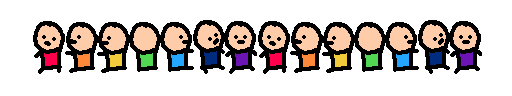

# Hello, I'm Nhoque!
I'm a almost-software engineer from brazil. I love making stuff with no skills whatsoever :D
Currently i'm 
## About Me
I'm a 20 year old guy that like mixing creativity with technology, so i love playing with gamedev and pixel art, even music sometimes! Also i love demoscenes. Also, I have ASD and ADHD, but honestly this makes me even more joyful at my life and things i create.

## What skills do I have?
### Languages (the spoken ones)
- Portuguese (Native)
- English (Intermediate)
- Spanish (Beginner)
- Japanese (Beginner, started learning by hobby!)

### Languages (the code ones)
- Python (Intermediate)
- JavaScript (Intermediate)
- HTML/CSS (Intermediate)
- PHP (god i freakin hate it)
#### I'm learning
- Java 
- C/C++ 
- C# 
- GdScript 
- Rust 
- Go 

### Images
- Affinity 
- Aseprite

## What do i use?
### My PC
#### For GPU...
- Nvidea GTX 750
#### For CPU...
- Intel Core i7 860 (8) 2.79 GHz
#### For OS...
- Linux Fedora Workstation 43

### Software
#### For coding...
- Jetbrains's IDEs! 
- Zed
#### For art...
- Aseprite (Aseprite my beloved <3)
- Krita
- Affinity
#### For Music... (actually this part i'm still learning)
- MilkyTracker
- Furnace
- Renoise
- OpenMPT
- FL Studio
#### For Game Dev...
- Godot
#### For Video Editing...
- Kdenlive

